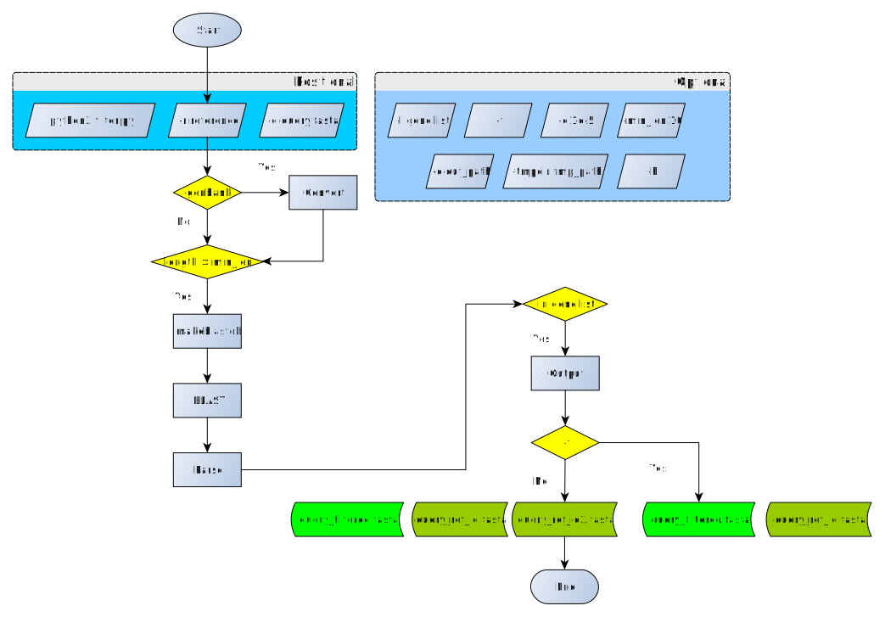

# filter.py

This program will filter contigs from assembled sequences according to
given reference file. Reference file could be genbank format which
contains annotation information which would be utilized by program or just
plain text such as fasta format. And reference could be only one record or
more.

If you provide gene.list and genbank format reference, you can filter
contigs by gene sequence. Or you could directly use whole reference
sequence as filter.

For output, first there will be **{contig filename}_filtered.fasta**, it
contains all filterd query sequences. Then there will be many
**{contig_filename}-{reference-sequence-id}.fasta** according to reference you
provide.

Before processing data, you can set "-min_len" of sequence, record in
query file shorter than given value will be droped. The default value is
10.

By default, the program will output whole sequence of query record, you
also could set "-f" to generate only matched fragments of query record
against reference in BLAST."""

## Requirement

1. [python3](https://www.python.org/downloads/)

    Be sure to install python3 rather than python 2.7. Besides, to use subprocess.call, you would better install python **3.5** or above.

2. [biopython](http://biopython.org/wiki/Download)

3. [BLAST Suite](https://blast.ncbi.nlm.nih.gov/Blast.cgi?PAGE_TYPE=BlastDocs&DOC_TYPE=Download)

## Usage

>python3 filter.py -r {reference file} -q {query file} -o {output directory}

See more in:

> python3 filter.py -h

## Flowchart

